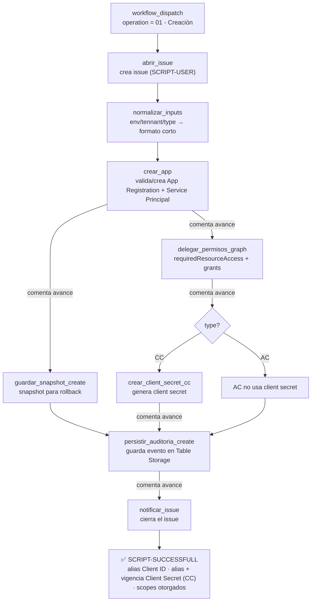
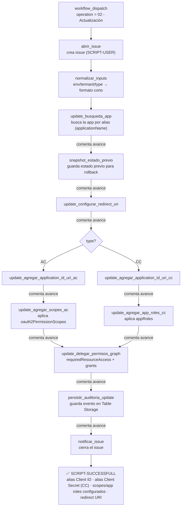

# automation-azure-b2c

Automatiza la creación y actualización de App Registrations de Azure AD B2C (flujos
Authorization Code y Client Credentials) vía Microsoft Graph, disparado por un workflow
de GitHub Actions (`workflow_dispatch`) que abre/comenta/cierra un issue de seguimiento
y audita cada corrida en Azure Table Storage.

## Workflows de GitHub Actions

```
.github/workflows/
  automation.yml                  Orquestador (workflow_dispatch): abre el issue, normaliza
                                   los inputs del dropdown UNA sola vez y llama al reusable
                                   workflow correspondiente según `operation`.
  create-app-registration.yml     Reusable workflow (workflow_call) con todo el flujo de
                                   creación: crear_app → delegar_permisos_graph →
                                   crear_client_secret_cc (solo CC) → persistir_auditoria_create,
                                   cada uno con su comentario de avance en el issue.
  update-app-registration.yml     Reusable workflow (workflow_call) con todo el flujo de
                                   actualización: update_busqueda_app → snapshot_estado_previo
                                   → configurar_redirect_uri → (rama AC: application_id_uri +
                                   scopes | rama CC: application_id_uri + app_roles) →
                                   delegar_permisos_graph → persistir_auditoria_update, cada
                                   uno con su comentario.
  revert-create-app-registration.yml  Standalone (workflow_dispatch, solo `ticket_number`):
                                   deshabilita (no borra) el Service Principal creado por la
                                   última operación de creación de ese ticket.
  revert-update-app-registration.yml  Standalone (workflow_dispatch, solo `ticket_number`):
                                   restaura identifierUris/web/spa/api/appRoles/
                                   requiredResourceAccess al estado capturado justo antes de
                                   la última actualización de ese ticket.
  automation-validate.yml         Orquestador independiente (workflow_dispatch): SOLO valida
                                   inputs contra Graph, no crea ni modifica nada. Abre su
                                   propio issue de seguimiento, llama a validate-create-inputs.yml
                                   o validate-update-inputs.yml según `operation`, y cierra el
                                   issue al terminar.
  validate-create-inputs.yml      Reusable workflow (workflow_call): consulta Graph si el
                                   client id (displayName generado) ya existe y, si es CC, si
                                   ya existe un client secret con el alias esperado. Comenta el
                                   resultado en el issue.
  validate-update-inputs.yml      Reusable workflow (workflow_call): compara los scopes/app
                                   roles solicitados contra los ya configurados en la app y
                                   comenta en el issue cuáles se agregarían y cuáles quedan
                                   configurados hoy pero fuera del request.
  tests.yml                       CI (push/PR): corre los tests de pytest y valida los 8
                                   workflows con actionlint.
```

Cada job que hace trabajo real termina con un step que comenta el avance en el issue (no es
un job aparte — se colapsó así a propósito: un job "solo comentar" significa levantar un
runner nuevo únicamente para una llamada a la API, y con ~20 de esos jobs el costo de
arranque se sumaba). Si un job falla antes de llegar a ese último step, simplemente no
comenta — mismo comportamiento que antes.

`automation.yml` invoca a los dos reusable workflows con `secrets: inherit` (heredan
todos los secrets del repo) y les pasa los inputs ya normalizados (`env`/`tennant`/`type`
en formato corto: `dev`/`cer`/`pro`, `persona`/`pyme`, `ac`/`cc`) más el `issue_number`
del issue de seguimiento, para que cada job interno pueda seguir comentando el avance.
Solo se ejecuta uno de los dos (`if: needs.normalizar_inputs.outputs.operation == 'create'|'update'`),
y `notificar_issue` cierra el issue leyendo los outputs del que sí corrió.

### Diagrama de flujo — Creación (AC vs CC)



### Diagrama de flujo — Actualización (AC vs CC)



## Rollback de la última operación

Cada operación de create/update guarda un **snapshot de rollback** en una tabla de
Table Storage dedicada (separada de la tabla de auditoría liviana), identificado por
`ticket_number`:

- **Create**: `guardar_snapshot_create` (dentro de `create-app-registration.yml`) guarda
  `app_id`/`app_object_id`/`sp_id` apenas termina `crear_app`.
- **Update**: `snapshot_estado_previo` (dentro de `update-app-registration.yml`) corre
  **antes** de cualquier PATCH — justo después de `update_busqueda_app` — y guarda el
  manifest completo (`GET /applications/{id}`) tal como estaba. Todos los jobs que
  modifican la app (`update_configurar_redirect_uri` en adelante) dependen de este job,
  así que no hay forma de que un update corra sin haber guardado antes el estado previo.

Cada fila vive en `PartitionKey=ticket_number`, `RowKey={createdAt}_{run_id}` — permite
que un mismo ticket tenga varias filas sin pisarse, y un revert marca la fila usada como
`reverted=true` para no volver a aplicarla dos veces.

Para revertir: disparar `revert-create-app-registration.yml` o
`revert-update-app-registration.yml` (el que corresponda) pasando solo `ticket_number`.
El job busca el snapshot en la tabla, resuelve `env`/`tennant` desde ahí mismo (no hace
falta indicarlos) y:
- **revert-create** deshabilita el Service Principal (`accountEnabled=false`) — no borra
  la App Registration, queda disponible para inspección o borrado manual.
- **revert-update** hace `PATCH` de vuelta con `identifierUris`/`web`/`spa`/`api`/
  `appRoles`/`requiredResourceAccess` tal como estaban antes del update.

Ambos workflows son standalone (no viven dentro de `automation.yml`) y no piden
aprobación manual — dependen únicamente de quién tiene permiso de disparar
`workflow_dispatch` en el repo.

**Limitación conocida:** el revert solo deshace la última operación no revertida de ese
`ticket_number`; no hay una pila de "deshacer N veces". Si se reutiliza el mismo
`ticket_number` para varias operaciones sobre apps distintas, el revert tomará la más
reciente de ese tipo.

## Estructura de `src/`

```
src/
  constants.py                     IDs y permisos fijos de Microsoft Graph
  configure.py                     Lógica de configuración (scopes, app roles, redirect/API URI) para el flujo update

  jobs/                            Todos los scripts ejecutables (python ./src/jobs/.../x.py), agrupados por flujo
    persist_table_storage.py       Compartido: persiste el JSONL de auditoría en Azure Table Storage
    delegate_graph_permissions_job.py  Compartido: delega permisos de Microsoft Graph — usado por create Y update

    create/                        Todo lo que solo usa el flujo de creación
      create_app_registration_job.py
      validate_service_principal_job.py
      verify_service_principal_propagation_job.py
      create_cc_client_secret_job.py       (solo CC)
      save_create_snapshot_job.py          Snapshot de rollback (app_id/app_object_id/sp_id)

    update/                        Todo lo que solo usa el flujo de actualización
      update_search_application_job.py
      save_pre_update_snapshot_job.py      Snapshot de rollback (manifest completo, ANTES del PATCH)
      update_configure_redirect_uri_job.py
      update_add_application_id_uri_job.py
      update_add_scopes_job.py             (AC)
      update_add_app_roles_job.py          (CC)

    revert/                        Deshacer la última operación (ver sección "Rollback")
      find_snapshot_env_job.py     Resuelve env/tennant del snapshot (solo Table Storage, sin Azure AD)
      revert_create_app_registration_job.py
      revert_update_app_registration_job.py

    validate/                      Validación de inputs contra Graph, solo lectura
      validate_create_inputs_job.py
      validate_update_inputs_job.py

  models/dto.py                    DTOs de input/runtime (CreateInputDTO, UpdateInputDTO, ...)
  services/graph_service.py        Cliente Azure CLI + Microsoft Graph (auth, GET/POST/PATCH, retries)
  services/table_storage_client.py Conexión SAS + bootstrap de tabla, compartido por auditoría e historial
  services/operation_history_service.py  Snapshots de rollback: build/save/find/mark-reverted
  utils/common.py                  Helpers puros (nombres, dedupe, ofuscación de secretos, carga de JSON)
  utils/runtime_config.py          Resuelve credenciales por ambiente/tenant desde variables de entorno
  utils/audit.py                   Helper para anexar eventos de auditoría en JSONL (ver nota abajo)
```

Cada job se invoca como script independiente (`python ./src/jobs/<flujo>/<job>.py`, o
`python ./src/jobs/<job>.py` para los dos compartidos). El bootstrap de cada script sube
directorios hasta encontrar el paquete `models/` para ubicar la raíz de `src/` e insertarla en
`sys.path` — funciona sin importar a qué profundidad esté el script, así que si movés o agregás
un job nuevo no hace falta tocar ese bloque. `configure.py`, `constants.py` y los paquetes
`models/`, `services/`, `utils/` viven siempre directo bajo `src/`.

### Cómo llegan los inputs del dispatch a cada job

Los jobs que necesitan el payload del `workflow_dispatch` (operation/channel/env/tennant/type/
name/applicationName/webRedirectUri/scopes) ya **no** escriben un JSON a disco para pasárselo a
sí mismos. Cada job de GitHub Actions define esos valores en su `env:` (variables `B2CC_INPUT_*`,
ej. `B2CC_INPUT_CHANNEL: ${{ inputs.channel }}`) y el script los lee con
`utils.common.load_dispatch_input_from_env()`, que arma el mismo dict que antes consumía
`CreateInputDTO.from_dict()`/`UpdateInputDTO.from_dict()` — la validación no cambió, solo el
transporte. Esto no es una optimización de I/O (el archivo era minúsculo); es evitar interpolar
`${{ inputs.x }}` directamente dentro del cuerpo de un script Python en el `run:` de un step, que
es el patrón que GitHub documenta como riesgo de *script injection* si algún input trae comillas o
backslashes. Pasarlo por `env:` es la forma segura.

Excepción deliberada: el comentario markdown que generan los workflows de validación
(`validate_*_comment.md`) sigue viajando por archivo — es texto multilínea con backticks, y ahí sí
un archivo es más robusto que variables de entorno.

## Credenciales por ambiente (GitHub Environments)

Las credenciales de Azure AD ya no se seleccionan por nombre de variable (`B2CC_DEV_PYME_*`,
etc.) — eso significaba exponer los 18 secrets en el `env:` de cada job aunque solo se usaran 3.
Ahora cada job que necesita autenticarse declara `environment: ${{ inputs.env }}-${{ inputs.tennant }}`
(ej. `dev-persona`, `cer-pyme`, `pro-persona`) y lee solo 3 nombres fijos:

```
B2CC_TENANT_ID / B2CC_CLIENT_ID / B2CC_CLIENT_SECRET
```

**Requiere crear 6 GitHub Environments** en el repo (Settings → Environments), cada uno con esos
3 secrets apuntando a las credenciales de esa combinación:

| GitHub Environment | Reemplaza a (secrets viejos) |
|---|---|
| `dev-persona` | `B2CC_DEV_TENANT_ID` / `B2CC_DEV_CLIENT_ID` / `B2CC_DEV_CLIENT_SECRET` |
| `dev-pyme` | `B2CC_DEV_PYME_TENANT_ID` / `B2CC_DEV_PYME_CLIENT_ID` / `B2CC_DEV_PYME_CLIENT_SECRET` |
| `cer-persona` | `B2CC_CER_TENANT_ID` / `B2CC_CER_CLIENT_ID` / `B2CC_CER_CLIENT_SECRET` |
| `cer-pyme` | `B2CC_CER_PYME_TENANT_ID` / `B2CC_CER_PYME_CLIENT_ID` / `B2CC_CER_PYME_CLIENT_SECRET` |
| `pro-persona` | `B2CC_PRO_TENANT_ID` / `B2CC_PRO_CLIENT_ID` / `B2CC_PRO_CLIENT_SECRET` |
| `pro-pyme` | `B2CC_PRO_PYME_TENANT_ID` / `B2CC_PRO_PYME_CLIENT_ID` / `B2CC_PRO_PYME_CLIENT_SECRET` |

En cada Environment, los 3 secrets se llaman **igual** (`TENANT_ID`, `CLIENT_ID`, `CLIENT_SECRET`)
— es el Environment el que los distingue, no el nombre. Aplica a los 6 workflows que autentican
contra Azure AD: `create-app-registration.yml`, `update-app-registration.yml`,
`validate-create-inputs.yml`, `validate-update-inputs.yml`,
`revert-create-app-registration.yml` y `revert-update-app-registration.yml`.

**Caso especial — los 2 workflows de revert:** solo reciben `ticket_number` como input; `env`/
`tennant` no se conocen hasta leer el snapshot guardado en Table Storage. Por eso cada uno tiene
un job previo, `buscar_snapshot`, que solo necesita `AZURE_TABLE_STORAGE_*` (sin credenciales de
Azure AD) para resolver `env`/`tennant` desde el snapshot y exponerlos como output; el job
`revertir_*` los usa recién ahí para fijar `environment: ${{ needs.buscar_snapshot.outputs.env }}-${{ needs.buscar_snapshot.outputs.tennant }}`
y autenticarse. El snapshot se consulta dos veces (liviano en `buscar_snapshot`, completo en
`revertir_*`) — es una lectura barata, no un problema real.

Además, para la auditoría: `AZURE_TABLE_STORAGE_CONNECTION_STRING` (SAS) y
`AZURE_TABLE_STORAGE_TABLE_NAME`. Para el rollback: la misma
`AZURE_TABLE_STORAGE_CONNECTION_STRING` más una variable **nueva**,
`AZURE_TABLE_STORAGE_HISTORY_TABLE_NAME` (repo/environment variable en GitHub, distinta
de la tabla de auditoría — hay que crearla antes de usar create/update, si no
`guardar_snapshot_create`/`snapshot_estado_previo` fallarán por falta de configuración).

## Dependencias

Solo `persist_table_storage.py` requiere una dependencia externa:
`pip install -r requirements.txt` (azure-data-tables). El resto usa únicamente stdlib
+ Azure CLI (`az`) instalado en el runner.

## Tests

`tests/` tiene ~340 tests de pytest cubriendo el **95% del código** de `src/` (DTOs,
`configure.py`, `graph_service.py`, los 18 scripts de job con su `main()`, `persist_table_storage.py`,
`operation_history_service.py`, etc.) — nada llama a Azure CLI ni a Microsoft Graph real, todo
mockeado en el límite de I/O (env vars, `az`, HTTP de Graph, Table Storage).

```
python -m venv .venv
.venv/bin/pip install -r requirements-dev.txt
.venv/bin/python -m pytest tests/ -v --cov=src --cov-report=term-missing
```

`.github/workflows/tests.yml` corre esto mismo en cada push/PR (con un piso de 85% de
cobertura — si baja de ahí, CI falla), más [`actionlint`](https://github.com/rhysd/actionlint)
sobre los 8 workflows (contextos inválidos, `needs` mal referenciados, shellcheck de los
`run:` — no solo sintaxis YAML). Para correr actionlint local:

```
bash <(curl https://raw.githubusercontent.com/rhysd/actionlint/main/scripts/download-actionlint.bash)
./actionlint -color
```
